# The Ember Table

**The Ember Table**

The decision to make this website is due to the user stories found [here](docs/markdowns/userstories.md).

You can also see how the user stories were made into sprints [here](docs/markdowns/plannedsprints.md).

As we progressed in the project some of the sprints were skipped due to time. You can see more in [Features](#features) section, especially [Features Left to Implement](#features-left-to-implement).

The design and layout is due to the wireframes shown below:

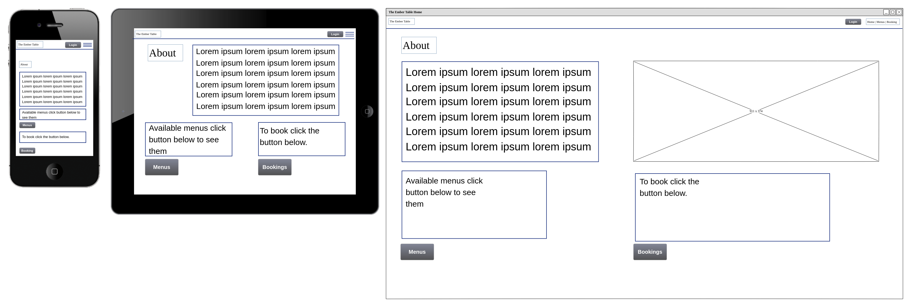

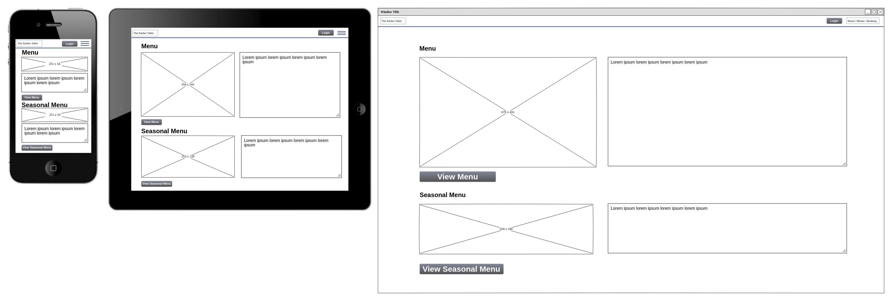

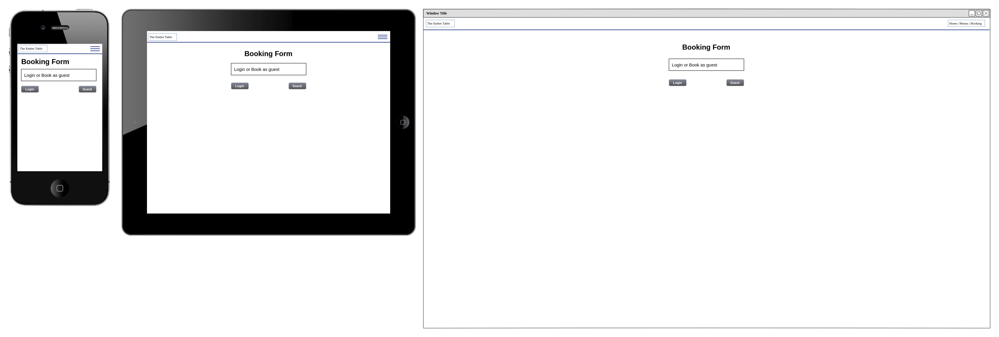

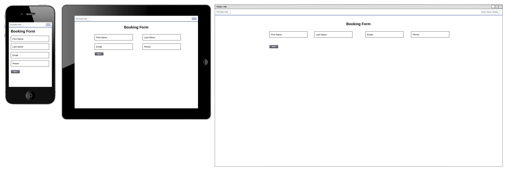

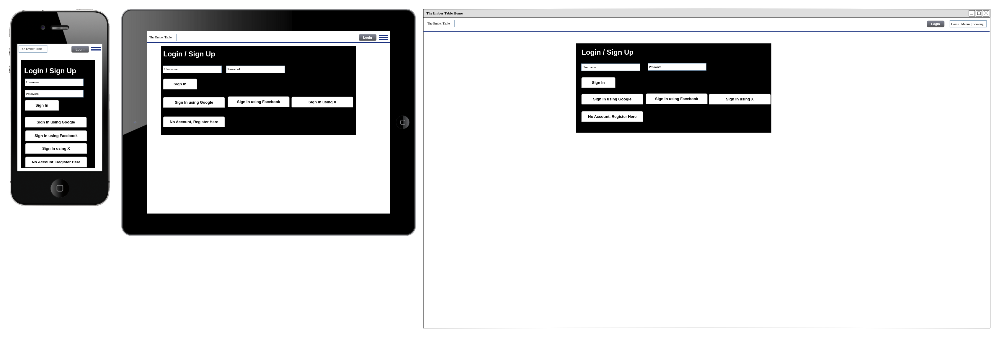

Alongside the user stories, sprints and wireframes ERDs were made and a logic flow chart.

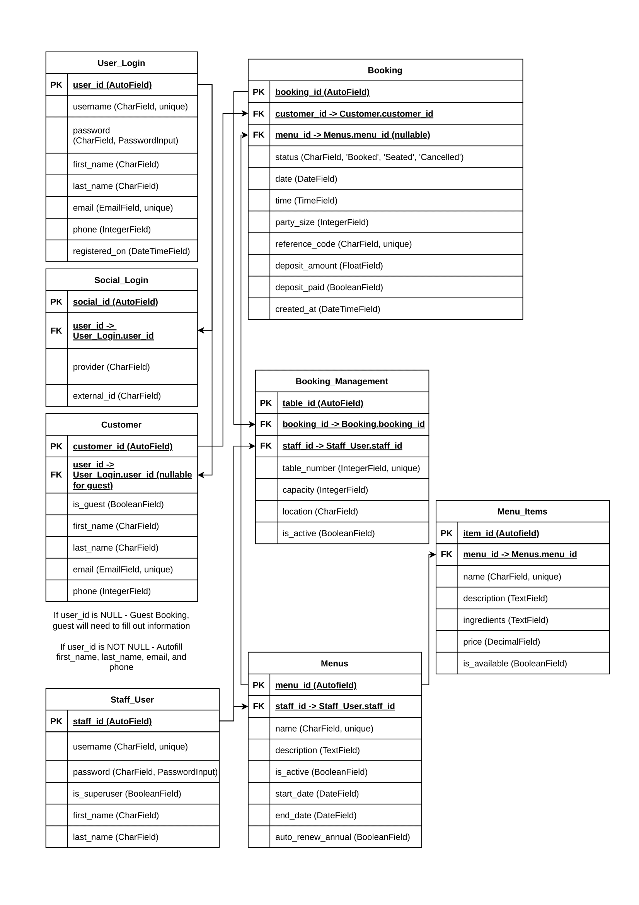

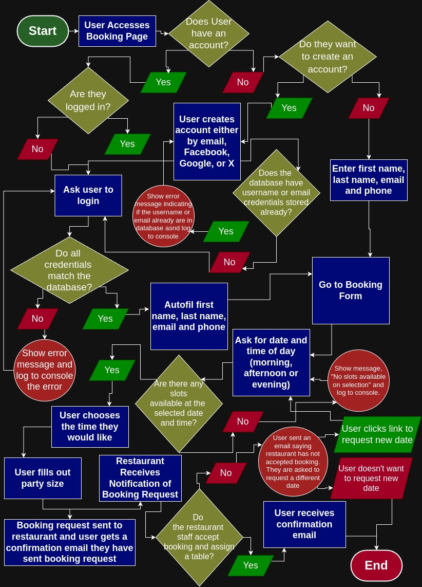

As you venture to look at the [Features](#features) you will notice some design choices, logic flow and relationships between the database tables were changed while the project was being made.

I would usually put a Am I Responsive screenshot here. However, it wasn't loading the image correctly and even when tested with the Django Blog walkthrough project it wouldn't load the images properly. Due to time constraints I couldn't look into this further.

## Features 

Below are the features for the website and at the end is listed any features that weren't able to be implemented but would be with more time.

### Existing Features

- __Navbar__

  - The navbar is dynamic for mobile and non mobile views.
  - The navbar is also dynamic depending on if a user is authenticated or not.

  - __Screen Navbar__

    - Unauthenticated User View
      - On wider screens you can see the Logo, Home, Bookings and Members in the Navbar.
      - The page the user is on is underlined and made bold to indicate the page the user is on.

    - Authenticated User View
      - On wider screens you can see the Logo, Home, Bookings, Username and Logout in the Navbar.
      - The page the user is on is underlined and made bold to indicate the page the user is on.

    - General
      - When clicking the Logo you will be redirected to the homepage.
      - When clicking Home, Bookings, Members or Username you are loaded onto the relevant page you clicked.
        - For the username you are loaded onto the members dashboard.
      - For logout you see the logout modal to confirm you want to logout.

    

    

  - __Mobile Navbar__

    - General
      - On mobile screens you can see the Logo and a burger menu.
      - When clicking the Logo you will be redirected to the homepage.
      - When clicking the burger menu you see a dropdown with the pages available and is dynamic if the user is authenticated or not.
      - For logout you see the logout modal to confirm you want to logout.

    - Unauthenticated User View Dropdown
      - On wider screens you can see the Home, Bookings and Members in the Dropdown Navbar.
    
    - Authenticated User View Dropdown
      - On mobile screens you can see the Home, Bookings, Username and Logout in the Dropdown Navbar.

    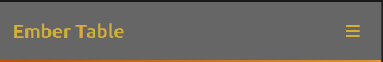

    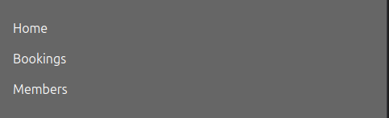

    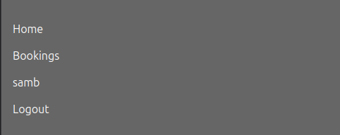

  - __Logout Form Modal__

    - When the user clicks logout a logout modal appears asking them to confirm.
    - If they click Cancel it closes and they stay on the same page.
    - If they click Logout they are logged out and the homepage is loaded with a success message.
    
    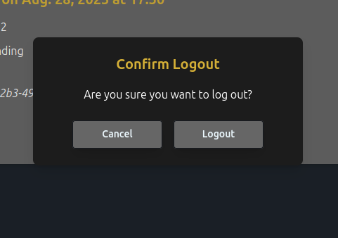

    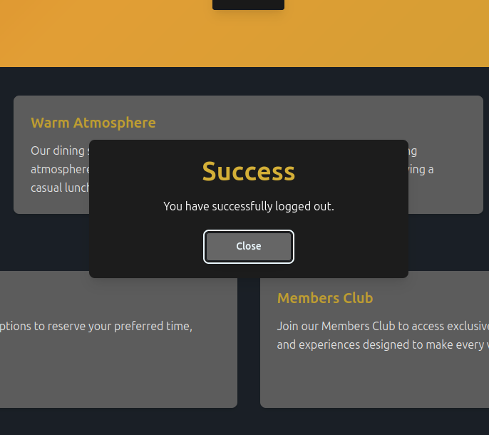

- __Footer__

  - In the footer you have the address and contact information with the copyright info the the side on wider screens.
  - On mobile screens they stack on top of each other.
  - Clicking the email or phone will take the user to their mailing app or phone app.

  

  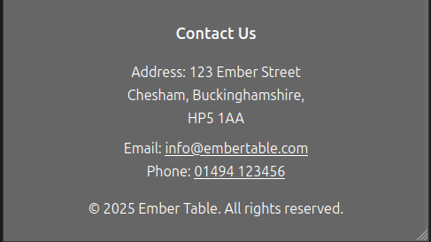

- __Homepage__

  - __Homepage Header__

    - The animated background is written using Tailwind CSS, this is used for consistency across all pages in the header
    - It welcomes the user to the site with the name of the restaurant in the header
    - A small tagline to make the user excited about visiting the restaurant
    - A Book Now button that links to the bookings page
    
    

  - __Homepage Body__

    - The body has two sections, first section is three cards and the second one is two cards.
    - Section 1 with the three cards all describe the appeal to attending the restaurant, they are side by side on wider screens and on narrower screens they stack on top of each other.
    - Section 2 with the two cards are showing how you book and the benefits of being a member.
    - Book card has a Book Now button that takes the user to the bookings page.
    - Members card has a Members button that takes them to the members page. 
    
    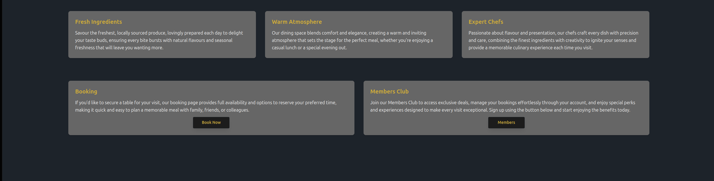

- __Bookings__

  - __Bookings Header__

    - The background is again the animated background.
    - Encourages the user to sign up or login to make a booking.
    - When the user is unauthenticated it has the Sign Up and Login buttons.
    - Sign Up button opens the Sign Up modal.
    - Login button opens the Login modal.
    - When the user is authenticated you see a book button, when clicked opens the booking form modal.
    
    

    

  - __Bookings Body__

    - Encourages the user to join the members club.
    - When the user is unauthenticated it has the Sign Up and Login buttons.
    - Sign Up button opens the Sign Up modal.
    - Login button opens the Login modal.
    - When the user is authenticated you see two cards one for booking and one for the members dashboard.
    - Booking one has a book button, when clicked opens the booking form modal.
    - Members dashboard one has a Dashboard button, when clicked takes them to their dashboard showing their bookings.
    
    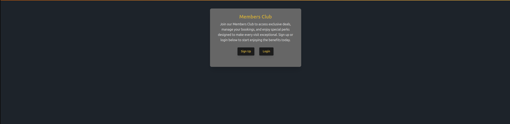

    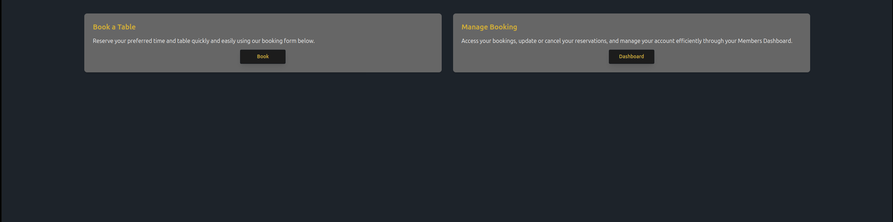

  - __Bookings Form Modal__

    - The form has three fields required, date, time and party size.
    - The username, first name, last name, email and phone number is assigned knowing the user is logged in
    - If any of the fields are not filled it it shows an error askign them to fill it in
    - If the form is submitted fully filled out, but the date is a passed date and/or the time is not between 12pm and 10pm and/or the party size is below 1 or above 20 an error message is displayed and they need to open the form again.
    
    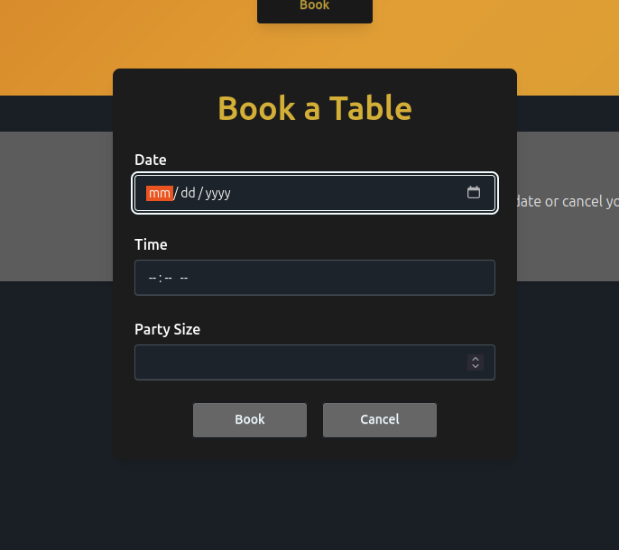

    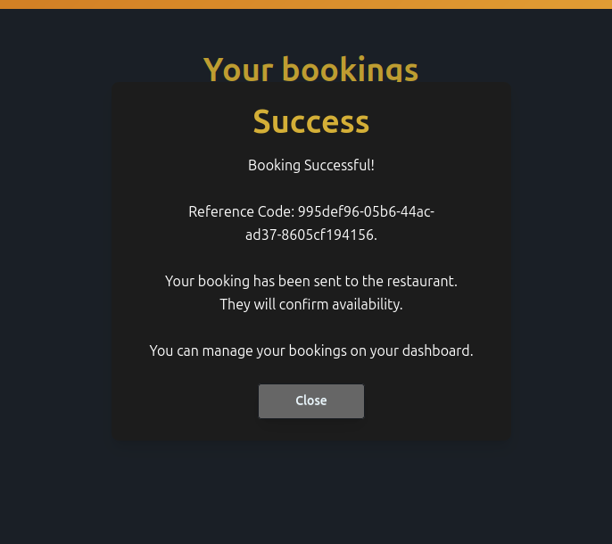

    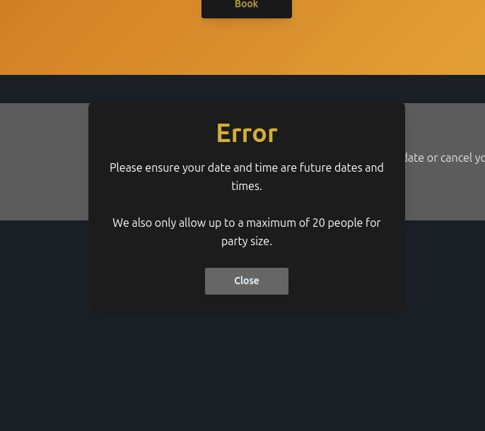

- __Members__

  - __Members Header__

    - Encourages the user to join the members club.
    - When the user is unauthenticated it has the Sign Up and Login buttons.
    - Sign Up button opens the Sign Up modal.
    - Login button opens the Login modal.
    
    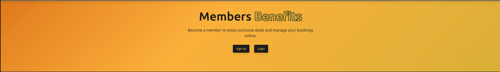

    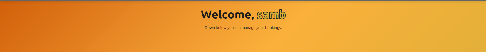

  - __Members Body__

    - Encourages the user to join the members club.
    - When the user is unauthenticated it has the Sign Up and Login buttons.
    - Sign Up button opens the Sign Up modal.
    - Login button opens the Login modal.
    - If the user is authenticated with no bookings the card displayed is one to encourage them to book, clicking book now takes them to the booking page.
    - If the user is authenticated with bookings that are not cancelled each booking is displayed on an individual card with the date, time, party size and the uuid generated reference code.
    - Each card also has a cancel and update button.
    - Clicking cancel opens a cancel confirmation modal.
    - Clicking update opens a update form modal with the date, time and party size pre filled out.
    
    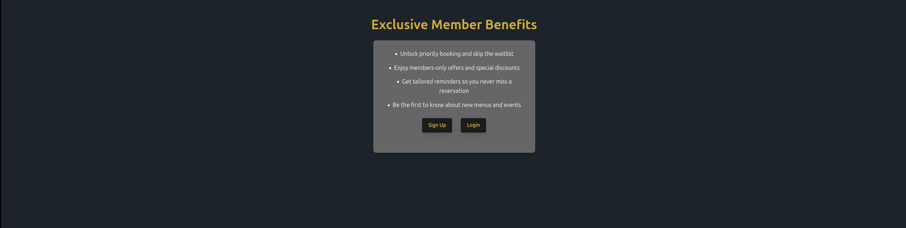

    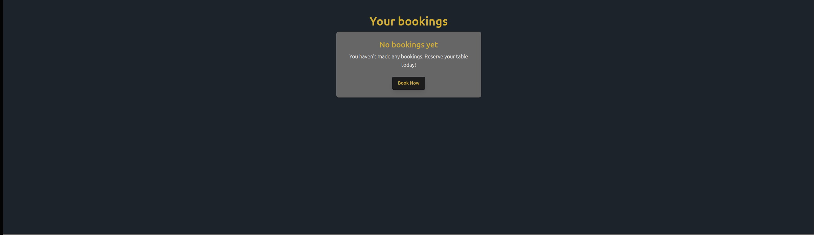

    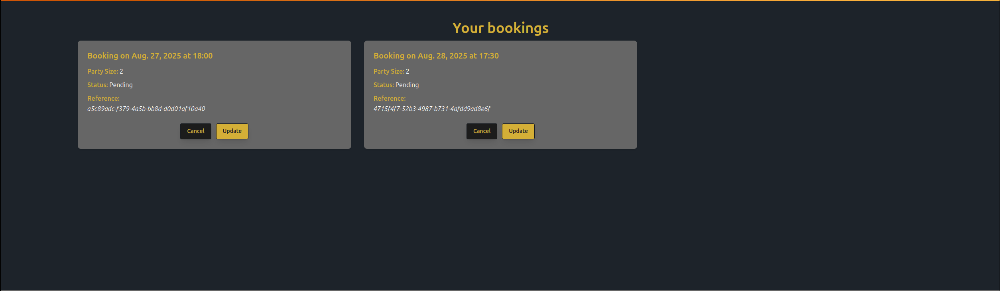

  - __Cancel Form Modal__

    - Displays a modal with a Yes and No.
    - If yes clicked and the booking can be found in the database a success message is shown, the dashboard is reloaded and the cancelled booking is removed from the list of bookings.
    - If no clicked the modal closes and the user sees all their bookings again.
    
    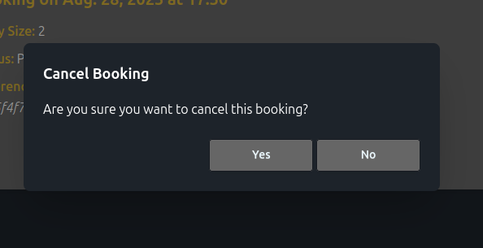

    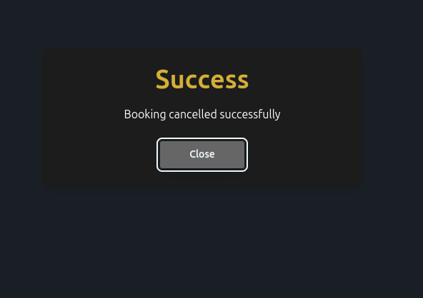

  - __Update Form Modal__

    - Displays a modal with the date, time and party size of the linked booking for the user to edit
    - Buttons update and close are at the bottom.
    - If they attempt to change the date, time or party size to a value not allowed they won't being to submit the form.
    - Clicking update will reload dashboard and show a success message.
    
    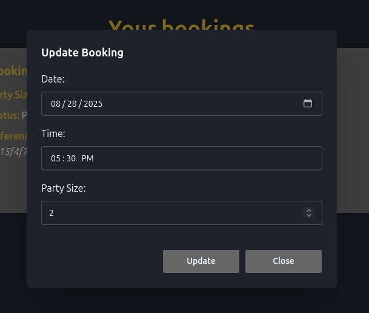

    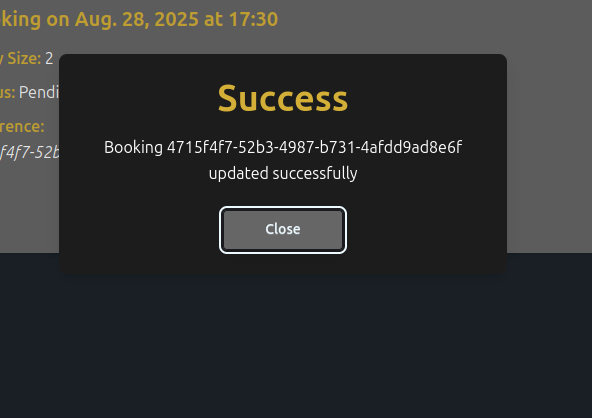

  - __Sign Up Form Modal__

    - A form with username, first name, last name, email, phone, password and confirm password appears.
    - All fields must be filled out correctly e.g. if the email doesn't have a @ and url.com it won't be valid.
    - If the username is taken an error message displays.
    - If the form is filled out correctly and username is not taken they see a success message and the page reloads.
    
    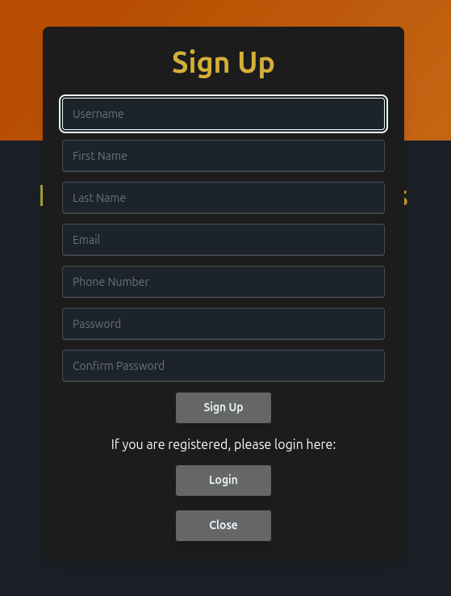

    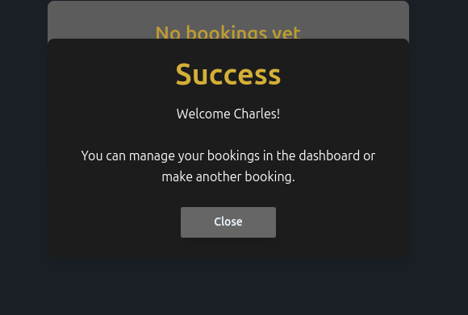

    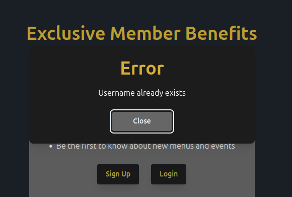

  - __Login Form Modal__

    - This form opens and asks for username or email and the password linked to it.
    - If credentials match what is in the database a success message appears and user is logged in on reloaded page.
    - If credentials do not match what is in the database an error message appears and user is not logged in on reloaded page.
    
    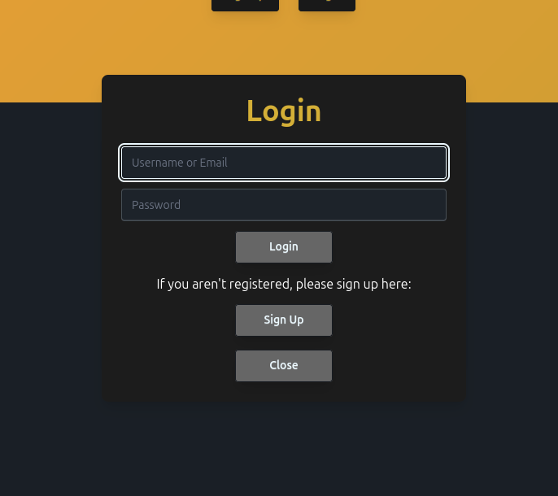

    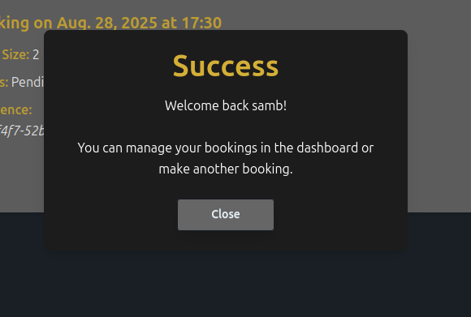

    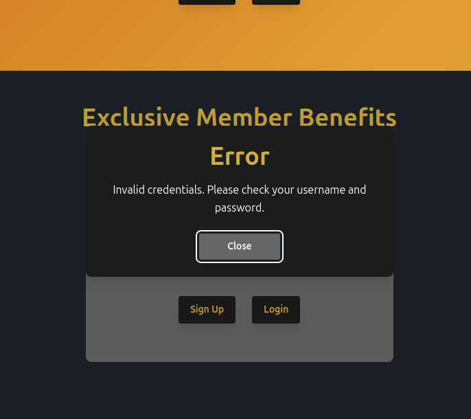

### Features Left to Implement

- Create a menu page that displays all menus that are active which can be controlled in the summer note admin area
- Allow guest users to make a booking
- Add a dropdown field where user can select the menu when booking
- Send an email when a user signs up to confirm their email
- Allow users to sign up using social media logins e.g. Gmail, Facebook, Twitter, etc
- Before submitting booking have a search available slots function
- Send confirmation email using utils.py and send_mail Django function when a user makes a booking, cancels a booking or they or the restaurant updates a booking
- Create a mobile app for users to have
- Have a deposit payment for special menus booking
- Provide analytics and reporting for the restaurant to see their customers, how many are users v guests, which menus are more popular, and other KPIs the restaurant wants
- In the future possibly using AJAX to make some of the form submissions to be more robust

## Testing 

The website has been manually and automatically tested.

You can see the manual testing table [here](docs/markdowns/manueltesting.md).

You can see the Django testing table [here](docs/markdowns/automateddjangotesting.md).

You can see the Jest testing table [here](docs/markdowns/automatedjstesting.md).

Please note for the Jest testing there was a need to create html fixture files as Jest doesn't always read the Django dynamic structure.

### Fixed Bugs

- C

### Unfixed Bugs

- None

### Validator Testing 

- Page Speed Insights
  - You can click the link to see the results from 27th August in the evening.
  - You can switch between the mobile and desktop results as well.
  - The tests were only run for the unauthenticated users.

    - [Homepage results](https://pagespeed.web.dev/analysis/https-the-ember-table-92576ef1108c-herokuapp-com/26tbjwcyd1?form_factor=mobile)

    - [Booking Page Results](https://pagespeed.web.dev/analysis/https-the-ember-table-92576ef1108c-herokuapp-com-booking/0s5f3v7zy7?form_factor=mobile)

    - [Members Page Results](https://pagespeed.web.dev/analysis/https-the-ember-table-92576ef1108c-herokuapp-com-members/oevejtur5a?form_factor=mobile)

- HTML
  - No errors were returned when passing through the official W3C Validator, see images below for each page.

    - Homepage
      
    

    - Booking Page
      
    

    - Members Page
      
    

- CSS
  - Due to using Django-Tailwind the Jigsaw validator had errors. 
  - All errors were to do with the @layer, @property and so forth. Therefore, I deemed it was all valid.
  - Due to using Dajngo-Tailwind I did not use the auto prefixer.
  
   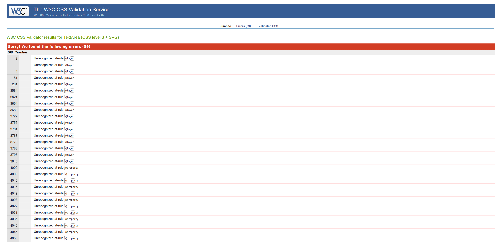

   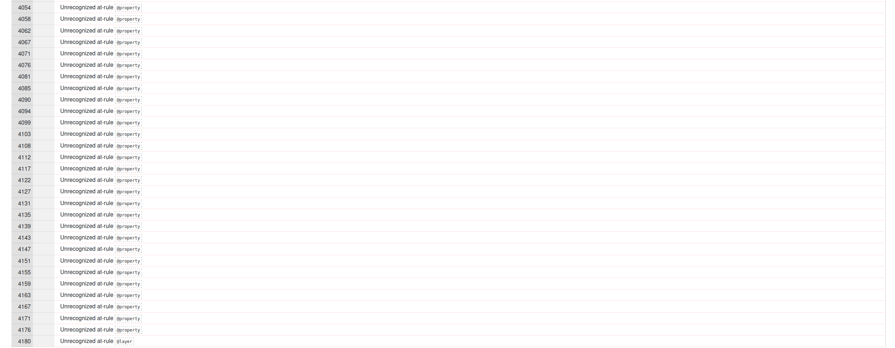

- JS
  - No errors were returned when passing through the official JS Hint, see images below for each page.

    - Alert JS
      
    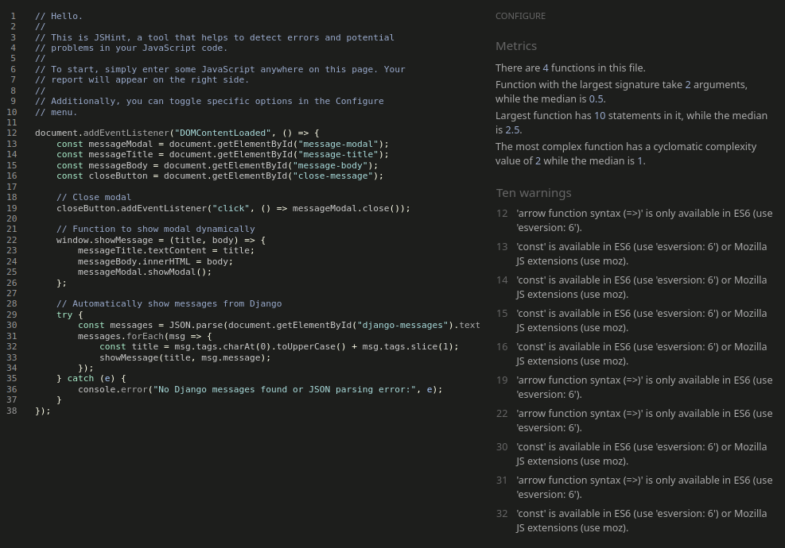

    - Booking Modals JS
      
    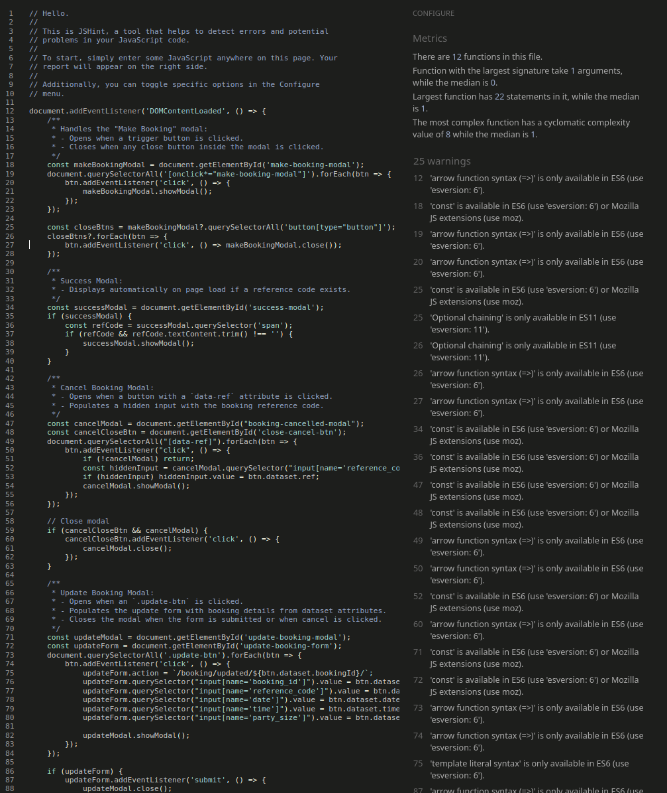

    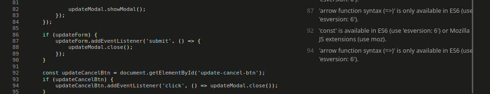

    - Modal Auth JS

    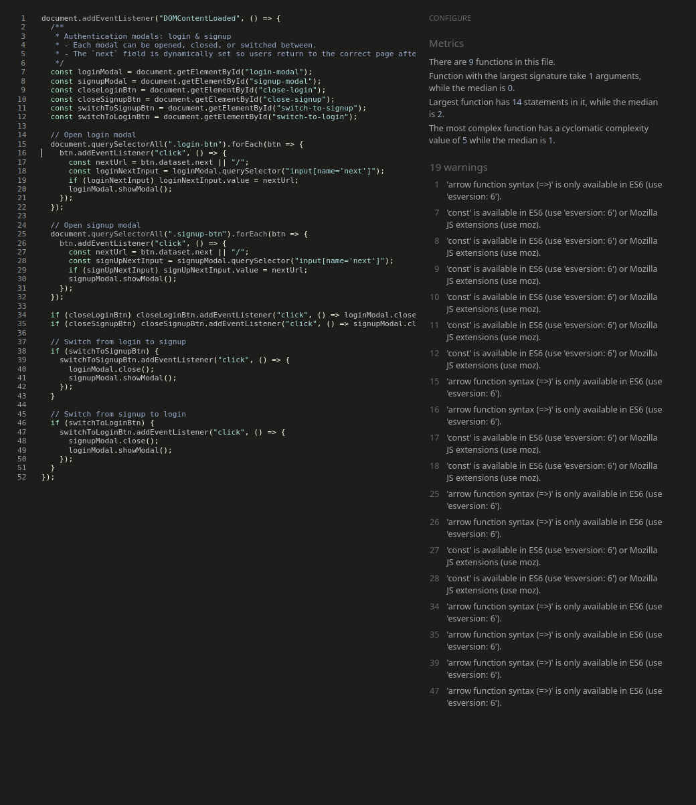

    - Navbar JS
      
    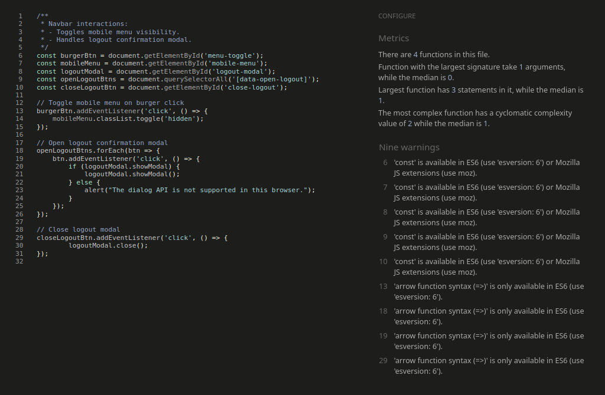

## Deployment

The app deployed via Heroku [here](https://the-ember-table-92576ef1108c.herokuapp.com/) following the below steps.

### Version Notes
Before going to Heroku make sure the .python-version is at the correct version.

You can check this by:
1. Typing python --version or python3 --version in your terminal
2. Update the file .python-version to the correct version
   1. The python version for this project as of xx/xx/2025 is 3.13.5

Important note, before upgrading to latest python version, check all the dependencies and modules are accepted by that version.

Once you have the correct version of python installed and noted, you then need to install the correct versions of the dependencies and update requirements.txt.

To do the above follow below:
1. Install the correct versions of the dependencies and modules
2. For the correct dependencies use pip install "dependency/module name" or pip3 install "dependency/module name"
   1. If the dependency or module is an older version add =="version"
3. Then type pip freeze > requirements.txt or pip3 freeze > requirements.txt to update requirements.txt

Before the final commit please ensure you have done the below:

1. Migrate everything in case there is something you have missed
   1. Do this by doing python manage.py makemigrations or python3 manage.py makemigrations
   2. Then type python manage.py migrate or python3 manage.py migrate
2. You will also want to ensure the tailwind style.css has been built properly
   1. Run python manage.py tailwind build or python3 manage.py tailwind build
   2. Then run python manage.py tailwind start or python3 manage.py tailwind start
3. After this you will need to collect all the static files by running python manage.py collectstatic or python3 manage.py collectstatic

### Creating the Heroku App
To create the app Heroku was used. In Heroku two buildpacks were needed and were accessed from the _Settings_ tab in Heroku. After adding the individual buildpacks the settings were saved. The two packs used and their ordering is as follows:

1. `heroku/node.js`
2. `heroku/python`

Then four config vars were needed and were created by going to _Settings_ tab in Heroku and scrolling down to _Config Var_ section. After each individual config var was added the settings were saved Then the following config vars were created: 

1. CLOUDINARY_URL - currently no images, but added for future features like menus
2. DATABASE_URL
3. NPM_CONFIG_PRODUCTION - for Django-Tailwind
4. SECRET_KEY

Then the GitHub repository was connected by following the below steps:

1. Go to _Deploy_ section
2. Select GitHub as the deployment method
3. Confirm we wanted to connect GitHub
4. Then search for the the-ember-table repository and connected it
5. Then in Manual deploy, select the main branch and click Deploy Branch, this should then deploy the app

## Cloning

This section describes how other software developers can clone the code to edit it elsewhere

- To clone the code so you can edit it yourself please follow the below:
PLEASE NOTE THIS IS FOR WINDOWS COMMAND LINE
  - In the GitHub repository click the dropdown for '<> code'
  - Ensure you are on 'local' and have 'https' selected, then copy the URL by clicking the symbol next to the URL box
  - Once copied in the search bar on your taskbar type in 'cmd' and open 'Command Prompt' or 'Comman Line'
  - In command line type 'git clone' and paste the url next to it
  - In file explorer locate 'This PC' down the side, then 'local disk' (usually the :C drive), then 'users', then your user, then find the folder called 'photo-guides'
  - You now have access to all the code and files locally
  - If you want to edit the code, please ensure you creat a new branch in the software you are using enabling us to potentially see the edits you have done before uploading them to the original GitHub repository
  - To create a new branch that depends on the software you are using, please google how to do this for your software

If you aren't on windows please google how to get a GitHub repository stored locally on your OS

 
## Credits 

Below are my credits for where I got inspiration for some of the code and content

- After google searching using Tailwind with Dajngo I came [Django-Tialwind docs](https://django-tailwind.readthedocs.io/en/latest/installation.html#)
- On the documentation it also mentions Tailwind Plugins such as DaisyUI, Tailwind Forms and Tailwind Typography
- Using [Tailwind docs](https://tailwindcss.com/) and [DaisyUI Docs](https://daisyui.com/docs/install/) I learnt the basics of using Tailwind and DaisyUI especially the [responsive navbar](https://daisyui.com/components/navbar/) and using [Dialog for modals](https://daisyui.com/components/modal/) along with dynamic JS.
- Using Django docs to find how to use UUID and validation
- My mentor mentioned the use of things like @login_required within Dajngo to help protect the views as well
- Helping me understand context processors and how to use globally I followed this [blog](https://medium.com/@akifonder/elevate-your-django-templates-with-context-processors-a-step-by-step-guide-9fc16faac4a5)
- Potential use of AJAX for future implementation inspiration was found from [here](https://www.geeksforgeeks.org/python/handling-ajax-request-in-django/)
- Reading the Django docs I came across send_mail for future implementation this could be used to send future emails as shown [here](https://docs.djangoproject.com/en/5.2/topics/email/)
- Majority of the enticing paragraphs and phrasing on the website has been generated using ChatGPT
